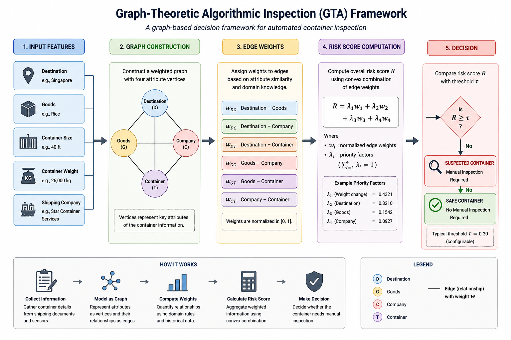

# Graph-Theoretic Algorithmic Inspection (GTA)

### A Graph-Based Decision Framework for Automated Container Inspection

> Transforming graph-theoretic models into practical decision-support algorithms.

  

---

## Overview

Graph-Theoretic Algorithmic Inspection (GTA) is a graph-based decision framework developed to support automated container inspection through weighted graph modeling and algorithmic decision making.

Originally developed as part of my Master's research in **Operations Research** at the **National Institute of Technology Durgapur**, GTA demonstrates how graph-theoretic concepts can be translated into practical decision-support software.

Unlike conventional rule-based inspection methods, GTA models the relationships among entities such as containers, goods, destinations, and shipping companies as a weighted graph. The resulting graph is analyzed to compute a quantitative risk score that assists in determining whether a container should undergo further manual inspection.

This repository contains the complete Python implementation of the proposed framework together with documentation and examples.

---
