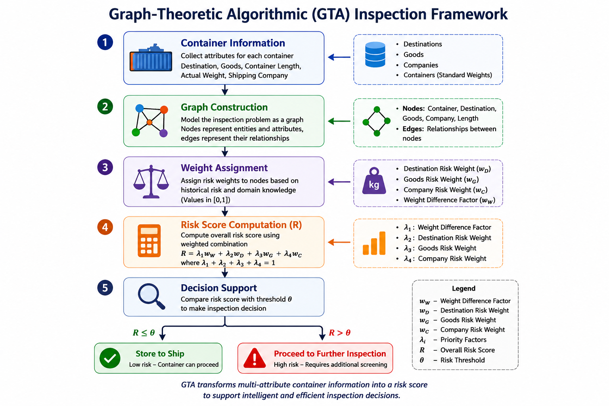

# Graph-Theoretic Algorithmic Inspection (GTA)

### A Graph-Based Decision Framework for Automated Container Inspection

> *Transforming graph-theoretic models into practical decision-support algorithms.*

<p align="center">
  
</p>

---

## Motivation

Modern seaports process millions of shipping containers every year, making comprehensive manual inspection both expensive and time-consuming. Although technologies such as X-ray scanners, gamma-ray scanners, and passive inspection systems assist security personnel, determining which containers deserve further inspection remains a challenging decision-making problem.

Graph-Theoretic Algorithmic Inspection (GTA) investigates how graph theory can support this decision process. Rather than relying solely on predefined rules, GTA models the relationships among containers, goods, destinations, and shipping companies as a weighted graph. The resulting graph is analyzed to compute a quantitative risk score that assists authorities in prioritizing containers for further inspection.

This project demonstrates how mathematical graph models can be translated into practical algorithmic software for decision support.

---

## Overview

Graph-Theoretic Algorithmic Inspection (GTA) is a graph-based decision framework originally developed during my Master's research in **Operations Research** at the **National Institute of Technology Durgapur**.

The framework models important entities involved in container transportation as vertices of a weighted graph. Relationships between these entities are represented by weighted edges, allowing the algorithm to evaluate the structural relationships among containers and their associated information.

Unlike traditional rule-based approaches, GTA provides a flexible graph-theoretic model capable of incorporating multiple attributes into a unified mathematical framework.

---

## Framework Workflow

The GTA framework follows four major stages:

1. **Collect container information**
   - Container ID
   - Goods
   - Destination
   - Shipping company
   - Physical attributes

2. **Construct the weighted graph**
   - Create vertices representing entities.
   - Assign weighted edges according to predefined relationships.

3. **Risk assessment**
   - Compute edge weights.
   - Evaluate the weighted graph.
   - Calculate a quantitative risk score using the proposed decision model.

4. **Decision support**
   - Recommend whether the container should undergo further manual inspection.

---

## Key Features

- Graph-theoretic modeling of container inspection
- Weighted graph representation
- Quantitative risk assessment
- Python implementation
- Decision-support framework
- Research-oriented software architecture

---

## Repository Structure

```text
graph-based-container-inspection/

├── images/
├── src/
├── datasets/
├── examples/
├── docs/
├── README.md
├── LICENSE
└── requirements.txt
```

---

## Installation

Clone the repository

```bash
git clone https://github.com/kumarrhimanshu/graph-based-container-inspection.git
```

Move into the project directory

```bash
cd graph-based-container-inspection
```

Install the required dependencies

```bash
pip install -r requirements.txt
```

---

## Applications

Although originally developed for automated container inspection, the underlying graph-theoretic framework can be adapted to other decision-support problems involving weighted relational data, including:

- Supply chain security
- Logistics optimization
- Network risk assessment
- Intelligent inspection systems
- Decision-support systems

---

## Future Work

Future developments may include:

- Dynamic graph models
- Machine learning assisted edge weighting
- Real-time inspection systems
- Large-scale graph optimization
- Interactive visualization dashboard

---

## Citation

If you find this project useful in your research, please cite the corresponding publication when available.

---

## Author

**Himanshu Kumar**

Ph.D. Student  
Department of Mathematics  
Indian Institute of Technology (IIT) Ropar

GitHub: https://github.com/kumarrhimanshu

---
